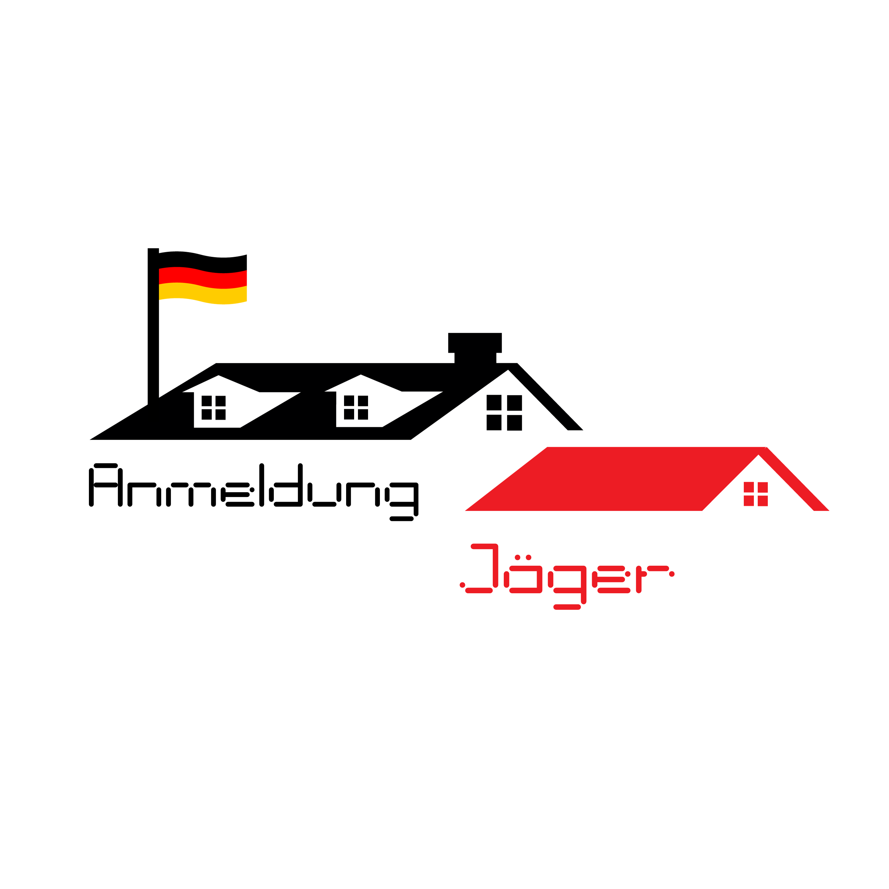
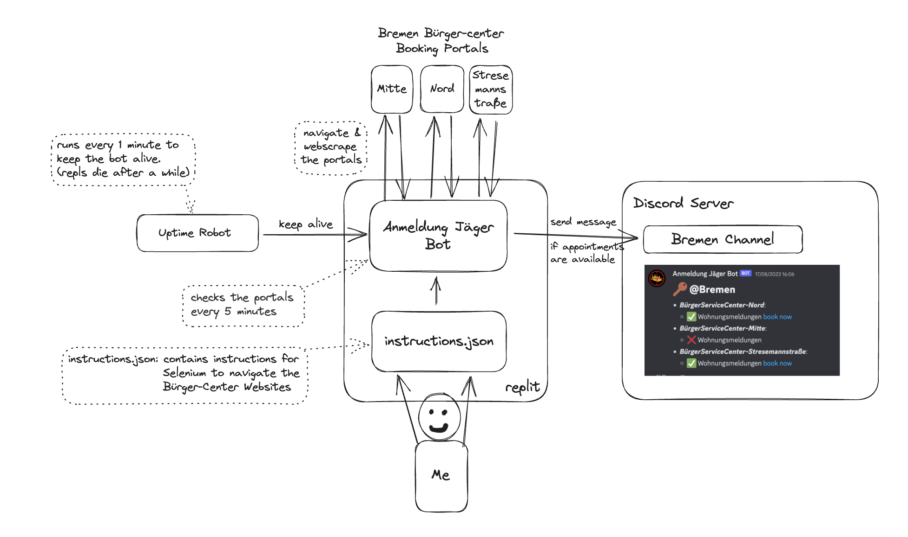

# Anmeldung Jäger Bot

# What does it do?
Anmeldung Jäger is a discord bot that lets me know whenever a free appointment is available for residence registration in Bremen, also known as "Anmeldung". IT DOES NOT BOOK THE APPOINTMENT FOR ME !!!

# Why?
Finding an Anmeldung appointment can be hard. You have to keep checking each day to see if a free appointment is available. What I have noticed is that the appointments are released at specific times during the day and they get booked fairly quickly, hence the need for an automated solution that lets you know when the appointments are available to quickly book your appointment :)

# How does it work?
It's entirely written in python:

